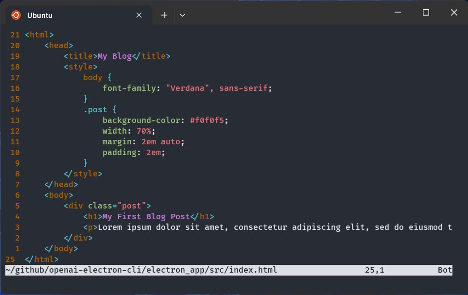

# OpenAI Electron


Command line tool to generate Electron application with OpenAI API

## Installation

You can install this project by using NPM

```bash
npm install --global openai-electron-cli
```

You can check if the project installed properly and the version of the project

```bash
openai-electron --version
```

You can see all the avaiable commands

```bash
openai-electron -H
```

## Command Usage

### `install`

Installing all electron depencies that needed to run an Electron application

### `set-prompt`

Set the prompt that will send to OpenAI to generate the source code

### `get-prompt`

Get the prompt that given by user. Example:

```bash
openai-electron get-prompt
# output:
# write a simple blog in HTML with CSS
```

### `generate-code`

Generate the source code by sending the prompt to OpenAI API. You need to have OpenAI API Key. Recommend to read [How to create OpenAI API keys](https://elephas.app/blog/how-to-create-openai-api-keys-cl5c4f21d281431po7k8fgyol0). Example:

```bash
openai-electron generate-code --openai-key "sk-4EdVbFhGP..."
# output:
# ✅ Source code generated successfully
# ✅ Source code saved and application is ready to run
```

### `edit-code`

View and edit the generated source code from OpenAI with text editor (default: `vim`). Example:

```bash
openai-electron edit-code --text-editor vim
```



### `run`

Run the generated source code as desktop application via `electron`


### `run-webserver`

Run the generated source code as Web application via HTTP server. Example:

```bash
openai-electron run-webserver
# output:
# ╭────────────────────────────────────────────────╮
# │                                                │
# │    Application run on http://localhost:5000    │
# │                                                │
# ╰────────────────────────────────────────────────╯
```

### `export`

Export the generated source code as executable program via `electron-forge`. Example:

```bash
openai-electron export -o .
# output:
# ? What is your platform? Linux
# ✅ Application packaged successfully
tree -L 3 .
# output:
# .
# └── out
#     ├── electron_app-linux-x64
#     │   ├── LICENSE
#     │   ├── LICENSES.chromium.html
#     │   ├── chrome-sandbox
#     │   ├── chrome_100_percent.pak
#     │   ├── chrome_200_percent.pak
#     │   ├── crashpad_handler
#     │   ├── electron_app
#     │   ├── icudtl.dat
#     │   ├── libEGL.so
#     │   ├── libGLESv2.so
#     │   ├── libffmpeg.so
#     │   ├── libvk_swiftshader.so
#     │   ├── locales
#     │   ├── resources
#     │   ├── resources.pak
#     │   ├── snapshot_blob.bin
#     │   ├── swiftshader
#     │   ├── v8_context_snapshot.bin
#     │   ├── version
#     │   └── vk_swiftshader_icd.json
#     └── make
#         ├── electron-app_1.0.0_amd64.deb
#         └── electron_app-1.0.0.x86_64.rpm

# 6 directories, 19 files
```
